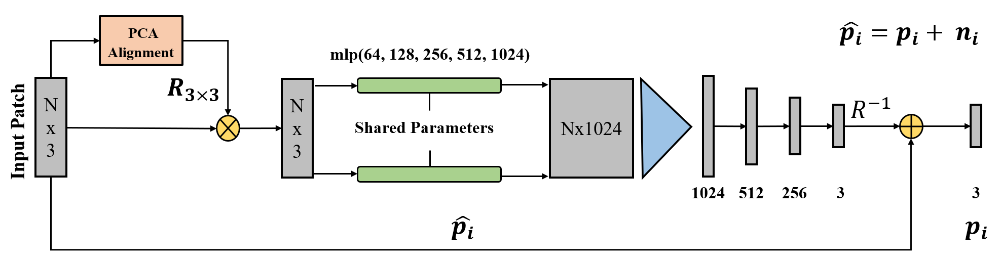

# Pointfilter: Point Cloud Filtering via Encoder-Decoder Modeling

# Pointfilter：通过编码器-解码器建模进行点云过滤

This is our implementation of Pointfilter, a network that automatically and robustly filters point clouds by removing noise and preserving their sharp features.

这是我们对 Pointfilter 的实现，该网络通过消除噪声并保留其清晰特征来自动且稳健地过滤点云。

<p align="center">  </p>

The pipeline is built based on [PointNet](http://stanford.edu/~rqi/pointnet/) (a patch-based version of [PointNet](http://stanford.edu/~rqi/pointnet/)). Instead of using STN for alignment, we align the input patches by aligning their principal axes of the PCA with the Cartesian space.

该管道基于 [PointNet]构建。 我们没有使用 STN 进行对齐，而是通过将 PCA 的主轴与笛卡尔空间对齐来对齐输入块。

## Environment
* Python 3.6
* PyTorch 1.5.0
* Windows 10 and VS 2017 (VS 2017 is used for compling the chamfer operators)
* CUDA and CuDNN (CUDA 10.1 & CuDNN 7.5)
* TensorboardX (2.0) if logging training info. 


## Datasets
You can download the training datasets used in this work from the following [link](https://entuedu-my.sharepoint.com/:f:/g/personal/n1805982j_e_ntu_edu_sg/Er5PVpfMIBZDiucsZSUX-AsB8QXXHIfzVfENWSj1u9TNng?e=wEFDZY), or prepare yourself datasets and change corresponding codes in `Pointfilter_DataLoader.py`. Create a folder named Dataset and unzip the files on it. In the datasets the input and ground truth point clouds are stored in different files with '.npy' extension. For each clean point cloud `name.npy` with normals `name_normal.npy`, there are 5 correponsing noisy models named as `name_0.0025.npy`, `name_0.005.npy`, `name_0.01.npy`, `name_0.015.npy`, and `name_0.025.npy`.  

您可以从以下[链接]下载本工作中使用的训练数据集，或准备 自己创建数据集并更改“Pointfilter_DataLoader.py”中的相应代码。 创建一个名为 Dataset 的文件夹并解压其中的文件。 在数据集中，输入点云和地面实况点云存储在扩展名为“.npy”的不同文件中。 对于每个具有法线“name_normal.npy”的干净点云“name.npy”，有 5 个相应的噪声模型，分别命名为“name_0.0025.npy”、“name_0.005.npy”、“name_0.01.npy”， `name_0.015.npy`和`name_0.025.npy`。

## Setup
Install required python packages:
``` bash
pip install numpy
pip install scipy
pip install plyfile
pip install scikit-learn
pip install tensorboardX (only for training stage)
pip install torch==1.5.0+cu101 torchvision==0.6.0+cu101 -f https://download.pytorch.org/whl/torch_stable.html
```

Clone this repository:
``` bash
git clone https://github.com/dongbo-BUAA-VR/Pointfilter.git
cd Pointfilter
```

Compile Chamfer Opertors (only for evaluation)
``` bash
cd ./Pointfilter/Customer_Module/chamfer_distance
python setup.py install
```

## Train
Use the script `train.py` to train a model in the our dataset (the re-trained model will be saved at `./Summary/Train`):

使用脚本“train.py”在数据集中训练模型（重新训练的模型将保存在“./Summary/Train”）：

``` bash
cd Pointfilter
python train.py
```

## Test with Pre-trained Model (The filtered results will be saved at `./Dataset/Results`)

# 使用预训练模型进行测试（过滤后的结果将保存在“./Dataset/Results”）

``` bash
cd Pointfilter
python test.py --eval_dir ./Summary/pre_train_model
```
## Test with Re-trained Model
``` bash
cd Pointfilter
python test.py --eval_dir ./Summary/Train
```
  
## Visual Results

<p align="center"> 

## Citation
If you use our work, please cite our [paper](https://arxiv.org/abs/2002.05968):
```
@article{zhang2020pointfilter,
  title={Pointfilter: Point cloud filtering via encoder-decoder modeling},
  author={Zhang, Dongbo and Lu, Xuequan and Qin, Hong and He, Ying},
  journal={IEEE Transactions on Visualization and Computer Graphics},
  year={2020}
}
```

## Acknowledgements
This code largely benefits from following repositories:
* [PointNet](http://stanford.edu/~rqi/pointnet/)
* [PCPNet](https://github.com/paulguerrero/pcpnet)
